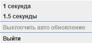

<!--suppress HtmlDeprecatedAttribute -->

    <h1>
        <a href="https://funprojectsforsoul.github.io/Vertex/">Project Vertex</a>
    </h1>

    

    
    
    
    

### Description
___

Desktop application for random updating of the displayed number from 0 to 100. It is possible to start updating the 
number by timer at intervals: 1 second or 1.5 seconds.

### Requirements
___

* **JDK**: 8 and higher;
* **Configured environment variable**: JAVA_HOME.

### Instructions for starting the project
___

*All commands are executed in the console.*
1. Create a folder: `mkdir GitProjects`;
2. Go to the folder: `cd GitProjects`;
3. Cloning a repository: `git clone https://github.com/FunProjectsForSoul/Vertex.git`;
4. Go to the folder: `cd Vertex`;
5. Build project: `mvn clean install`;
6. After completing 5 points — a folder with the name **“Target”** will be created. We go into it: `go target`;
7. Inside there will be a JAR file named **“vertex-0.2.2.jar”**.
   We execute the command: `java -jar vertex-0.2.2.jar`;
8. The GUI application will start **(see: Application interface)**.

**Bonus**: instead of point 7, you can act differently.
In the folder — **target**, there will also be a file: **vertex.exe**, which you can simply run.
If you have any problems — write to me.

### Application interface
___

### License
___

**[Creative Commons Legal Code](https://github.com/Bangerok/Vertex/blob/master/LICENSE)**

_Copyright ©2021, Vladislav [[Bangerok]](https://github.com/Bangerok) Kuznetsov_